# InnoDB锁分析

Mysql存储引擎常见的有InnoDB、MyISAM、Memory，而InnoDB最初由第三方开发，后来被Oracle收购并于5.5.8版本开始成为默认的存储引擎，也成为应用最为广泛的引擎。本文就来分析它比较棘手的在生产环境中的死锁问题。

- 死锁是如何产生的

- 如何排查线上死锁

- 如何避免死锁

## 数据库的锁的种类

- 全局锁
  
  - 锁住整个数据库

- 表级锁
  
  - 表锁
  - 元数据锁

- 行锁
  
  - Record Lock（记录锁）：锁定一条记录
  
  - Gap Lock（间隙锁）：锁定一个范围，只存在于**可重复读**隔离级别。间隙锁和间隙锁是兼容的，即两个事务可以同时持有包含同一个范围的间隙锁。
  
  - Next-Key Lock（临键锁），其实是Record Lock和Gap Lock的组合
    
    为什么叫Next-Key Lock?因为相对于Previous-Key Lock（锁定的区间是前闭后开，比如[10,20)，Next-Key Lock锁定的区间是前开后闭，比如(10,20]
  
  行锁是Innodb引擎为了在RR（可重复读）级别下解决幻读而存在的。

> 事务的隔离级别有哪些？

- Read Uncommited （读未提交）

- Read Commited（读提交）

- Repeatable Read（可重复读）

- Serialize（串行化）

MyISAM存储引擎不支持事务，不支持行级锁，所以在这里深入探讨Innodb引擎的锁。

死锁通常由于行级别的锁导致的，所以重点探讨行级别的锁。

## 哪些语句会导致加行级锁

|                                                        | 锁类型 | 说明                                      |
| ------------------------------------------------------ | --- | --------------------------------------- |
| select xxx from table_xxx where ...                    | 无锁  | 因为它属于**当前读**，通过MVVC机制保证读到ReadView创建时的记录 |
| select xxx from table_xxx where ... for share          | S   |                                         |
| select xxx from table_xxx where ... lock in share mode | S   | 等同于上一行的 for share                       |
| select xxx from table_xxx where ... for update         | X   |                                         |
| update xxx where ...                                   | X   |                                         |
| delete xxx where ...                                   | X   |                                         |
| insert xxx where ...                                   | X   |                                         |

## X锁与S锁之间的互斥关系

|     | S（共享锁） | X（排它锁） |
| --- | ------ | ------ |
| S   | 兼容     | 不兼容    |
| X   | 不兼容    | 不兼容    |

### X锁会阻塞其他事务的S锁、X锁申请

| 时间  | 事务1                                          | 事务2                                                             |
| --- | -------------------------------------------- | --------------------------------------------------------------- |
| T1  | start transaction;                           |                                                                 |
| T2  | select * from user where id = 10 for update; | start transaction;                                              |
| T3  |                                              | select * from user where id = 10 lock in share mode; // S型行锁，阻塞 |
| T4  | commit;                                      |                                                                 |

以上，事务1在T2时持有X型记录锁，事务2在T3时会一直阻塞，事务1T4释放了X型记录锁，事务2可以继续执行。

| 时间  | 事务1                                          | 事务2                                                     |
| --- | -------------------------------------------- | ------------------------------------------------------- |
| T1  | start transaction;                           |                                                         |
| T2  | select * from user where id = 10 for update; | start transaction;                                      |
| T3  |                                              | select * from user where id = 10 for update; // X型行锁，阻塞 |
| T4  | commit;                                      |                                                         |

以上，事务1在T2时持有X型记录锁，事务2在T3时会一直阻塞，事务1T4释放了X型记录锁，事务2可以继续执行。

### S锁会阻塞其他事务的X锁申请，但是不会阻塞S锁申请

| 时间  | 事务1                                                  | 事务2                                                |
| --- | ---------------------------------------------------- | -------------------------------------------------- |
| T1  | start transaction;                                   |                                                    |
| T2  | select * from user where id = 10 lock in share mode; | start transaction;                                 |
| T3  |                                                      | select * from user where id = 10 for update; // 阻塞 |
| T4  | commit;                                              |                                                    |

以上，事务1在T2时持有S型记录锁，事务2在T3时会一直阻塞，事务1T4释放了S型记录锁，事务2可以继续执行。

| 时间  | 事务1                                                  | 事务2                                                        |
| --- | ---------------------------------------------------- | ---------------------------------------------------------- |
| T1  | start transaction;                                   |                                                            |
| T2  | select * from user where id = 10 lock in share mode; | start transaction;                                         |
| T3  |                                                      | select * from user where id = 10 lock in share mode; // 成功 |
| T4  | commit;                                              |                                                            |

以上，事务1在T2时持有S型记录锁，事务2在T3时可以直接执行。

## 行级锁的范围分析

### 唯一索引等值查询

这里再次强调，**普通**的`select xxx from table_xxx where ...` 是不会加锁的，后面分析的时候，也都是通过`select xxx from table_xxx where xxx for update;` 、`select xxx from table_xxx from xxx lock in share mode;`才会有加锁。

使用以下这个表进行测试分析

```sql
create database test;
use test;
CREATE TABLE `user` (
  `id` int NOT NULL AUTO_INCREMENT,
  `name` varchar(10) DEFAULT NULL,
  `age` int DEFAULT NULL,
  PRIMARY KEY (`id`),
  KEY `user_age_index` (`age`)
) ENGINE=InnoDB
```

表中的数据如下


#### 1. 等值查询的记录存在时

```sql
start transaction;
select * from user where id = 10 for update;
```

##### 如何分析当前数据库加了什么锁？

mysql8.0 可以通过`select * from performance_schema.data_locks\G`查看当前系统中的事务、锁类型、锁等待情况、锁记录的范围


- **LOCK_TYPE**指示锁类型
  
  - RECORD：行级锁
  
  - TABLE：表级锁

- **LOCK_MODE**指示锁的模式
  
  - X,REC_NOT_GAP：记录锁（Record Lock）
  
  - X,GAP：间隙锁（Gap Lock）
  
  - X：临键锁（Next-Key Lock）
  
  - IX：插入意向锁（Insert Intention Lock）

从这个图中可以看到这个事务加了两个锁，分别为

- 表级别的X型意向锁（后文详细分析，这里关注行级别锁）

- 行级别的**X型记录锁**，id=10的索引上加了一个**Record Lock**，意味着此时其他事务不能更新、插入、删除id=10的记录
  
  |     | 事务1                                         | 事务2                                                                                                                                    | 说明                 |
  | --- | ------------------------------------------- | -------------------------------------------------------------------------------------------------------------------------------------- | ------------------ |
  | T1  | start transaction;                          | start transaction;                                                                                                                     |                    |
  | T2  | select * from user where id =10 for update; |                                                                                                                                        |                    |
  | T3  |                                             | update user set age =11 where id = 10; // 阻塞<br/>insert into user(id) values(10); // 阻塞<br/>delete from user where id = 10; // 阻塞<br/> | id值为10的Record Lock |

##### 结论

**唯一索引等值查询，且记录存在时，行级别的锁是Record Lock，而非Gap Lock、Next-Key Lock。**

- 因为该事务对PRIMARY索引的id=10的记录加了记录锁，所以其他事务**无法插入**该记录，该事务多次查询id=1的记录时，不会出现**结果集多**了的情况，也就避免了幻读。

- 因为该事务对PRIMARY索引的id=10的记录加了记录锁，所以其他事务**无法删除**该记录，该事务多次查询id=1的记录时，不会出现**结果集少**了的情况，也就避免了幻读。

- 而幻读就是由于其他事务的**插入、删除**导致本事务查询的结果集不同的场景。

- 此时不需要大范围的Next-Key Lock和Gap Lock即可避免幻读。

#### 2. 等值查询的记录不存在的情况

从三个示例来看，这里数据范围还是如下，即id=10,11,20,30，表中最小id_min=10，最大id_max=30。因为我们只看等值查询记录不存在的情况，所以我们不看id=id_min和id=id_max的情况，也就是开区间。


##### 1. where 条件的id介于表(id_min, id_max)之间时

```sql
-- 表中数据是id=10,11,20,30
start transaction;
select * from user where id = 15 for update; -- 此时15介于(11,20)之间
```


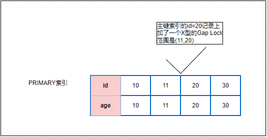

从图中可以看出，该事务加1个行级别的锁（表级别的锁不在赘述）即为

- X型的间隙锁（行级别）：在PRIMARY索引的id=20的记录上加了一个X型的Gap Lock，范围是（11，20），也就是说如果其他事务此时插入id为12、13、14、15、16、17、18、19的记录时都会被阻塞。

例如以下两个事务

| 时间  | 事务1                                          | 事务2                                     |
| --- | -------------------------------------------- | --------------------------------------- |
| T1  | start transaction;                           | start transaction;                      |
| T2  | select * from user where id = 15 for update; |                                         |
| T3  |                                              | INSERT INTO test.user (id) VALUES (12); |
| T4  |                                              | **此时被阻塞**                               |
| T5  | commit;                                      |                                         |

> 间隙锁的范围如何确定？

- 11即是比15小的临近的那个id值。

- 20即是比15大的临近的那个id值，也就是**LOCK_DATA**的值。

> **为何此时不是Next-Key Lock**？

因为Next-Key Lock锁记录范围是(11,20]，但是即使事务2此时删除id=20的记录，也不会造成事务1的幻读，因为事务1的查询条件是id=15。

> **为何此时不是Record Lock**？

因为锁是加在索引上的，而此时id=15并不在索引内，而(11,20)正是那个包含15的最小的范围。

##### 2. where 条件的id>id_max时

- 锁范围为(30,+∞]，此时展示的是**Next-Key Lock**

```sql
-- 表中数据依然是id=10,11,20,30
start stransaction;
select * from user where id = 50 for update; -- 此时50>30
```


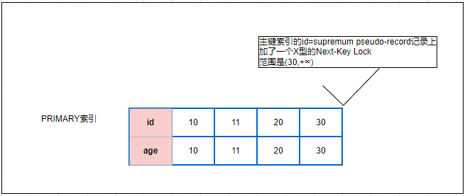

 因为LOCK_DATA只展示上限，而此时表中大于`id=50`的临近的id是+∞，表中小于`id=50`的临近的id是30，所以锁定范围是(30,+∞]。

注意：虽然这里展示的时Next-Key Lock，但实际索引上并没有`supremum pseudo-record`这个记录，也就是说实际上加的也还是**Gap Lock**。这点在后面分析幂等插入订单场景时可以见到。

##### 3. where 条件的id<id_min时

- Gap Lock范围是（-∞,10）

```sql
-- 表中数据依然是id=10,11,20,30
start stransaction;
select * from user where id = 5 for update; -- 此时5<10
```


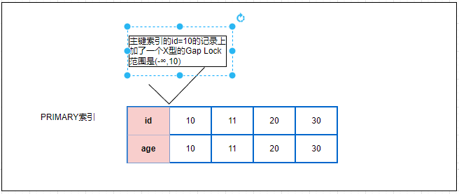

因为LOCK_DATA只展示上限，而此时表中大于`id=5`的临近的id是10，而小于`id=5`的临近的id值是-∞，所以Gap Lock范围是（-∞,10）

##### 结论

- **唯一索引等值查询且记录不存在时，行级别的锁是Gap Lock或Next-Key Lock**，而非Record Lock

- 只有where条件的id>id_max时，`select * from performance_schema.data_locks\G`展示的是Next-Key Lock，其他情况都是Gap Lock。但实际索引上并没有`supremum pseudo-record`这个记录，也就是说实际上加的也还是**Gap Lock**

### 唯一索引范围查询

#### 1. 大于（>）

```sql
-- 表中数据依然是id=10,11,20,30
start transaction;
select * from user where id > 25 for update;
```


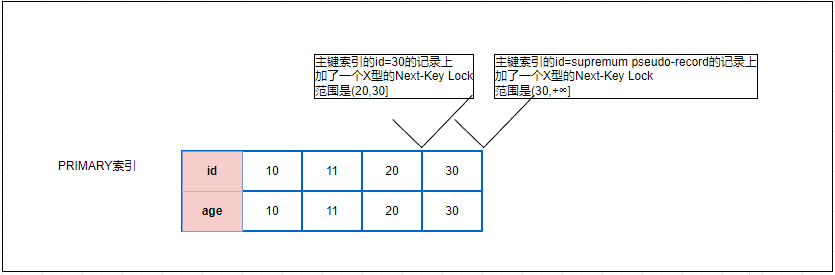

从上图可知，加了两个Next-Key Lock分别为（表级别的X型意向锁就不再赘述）

- 在id=30的索引上加了一个**Next-Key Lock**，锁定范围为**\(20, 30]**，意味着其他事务此时不能更新、插入、删除id=30的记录，也不能插入id值范围为(20,30)的记录
  
  - 此时也可以`update user set age = 25 where id = 25`，同样因为索引中没有这条记录，引擎直接返回
  
  - 但是此时可以`delete from user where id = 25`，因为索引中没有这条数据，引擎直接返回
  
  - 

- id值为supremum pseudo-record的Next-Key Lock，锁定范围为**\(30, +∞]**，意味着其他事务此时不能插入id>30的记录

以下示例可以验证说明

|     | 事务1                                          | 事务2                                                                                                                                                                          | 说明                                             |
| --- | -------------------------------------------- | ---------------------------------------------------------------------------------------------------------------------------------------------------------------------------- | ---------------------------------------------- |
| T1  | start transaction;                           | start transaction;                                                                                                                                                           |                                                |
| T2  | select * from user where id > 25 for update; |                                                                                                                                                                              |                                                |
| T3  |                                              | update user set age =33 where id = 30; // 阻塞<br/>insert into user(id) values(30); // 阻塞<br/>delete from user where id = 30; // 阻塞<br/>insert into user(id) values(25); // 阻塞 | id值为30的Next-Key Lock，锁定范围为(20, 30]             |
|     |                                              | update user set age = 25 where id = 25；// 成功<br/>delete from user where id = 25；// 成功                                                                                        | 因为id=25的记录本身不存在，引擎认为直接返回成功并不会产生幻读影响，同时不会阻塞应用程序 |

> 为什么是范围是(20,30]，而不是(25,30]？

因为锁是加在索引上的，索引中并没有id=20的记录，而(20,30)正是那个包含15的最小的范围。

#### 2. 大于等于（>=）

```sql
-- 表中数据依然是id=10,11,20,30
start transaction;
select * from user where id >= 20 for update;
```


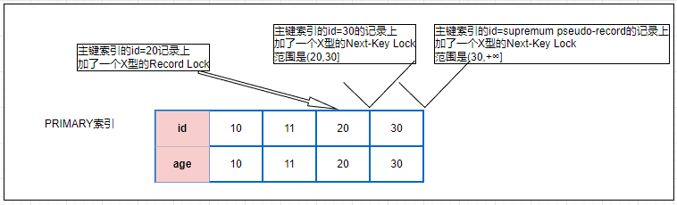

从上图可知，加了两个Next-Key Lock和一个1个Record Key，分别为（表级别的X型意向锁就不再赘述）

- 在id=supremum pseudo-record的主键索引上加了一个**Next-Key Lock**，范围是(30,+∞]，意味着其他事务无法插入id>30的记录

- 在id=30的主键索引上加了一个**Next-Key Lock**，锁定范围为(20, 30]，意味着其他事务此时不能更新、插入、删除id=30的记录，也不能插入id值范围为(20,30)的记录

- id=20记录的主键索引上加了一个**Record Lock**，意味着其他事务无法更新、插入、删除这条记录，此时该记录锁等同于前面的**等值查询且记录存在**的功能

从这里可以看出来，大于等于(>=)其实就是大于和等于的两种场景的锁的情况的结合。

##### 类比`where id >= 25`,表中不存在id=25的数据

`where id>=25`  等同于 `where id>25` 和 `where id=25`两种情况的结合，而两种情况的行记录加锁情况分别为

- where id>25
  
  - (20, 30]，id=30上的Next-Key Lock
  
  - (30, +∞], id=supremum pseudo-record的Next-Key Lock

- where id=25
  
  - (20, 30)，id=30的Gap Lock

- 综合后，由于(20, 30]，id=30上的Next-Key Lock包含(20, 30)和id=30的Gap Lock，所以最终结果应该为(30, +∞]和(20, 30]这两个Next-Key Lock

```sql
-- 表中数据依然是id=10,11,20,30
start transaction;
select * from user where id >= 25 for update; // 表中不存在id=25的数据
```

通过验证，类比结果正确


#### 3. 小于（<）

```sql
-- 表中数据依然是id=10,11,20,30
start transaction;
select * from user where id < 15 for update;
```


从上图可知，加了两个Next-Key Lock 和一个Gap Lock，分别为（表级锁不在赘述）：

- 在id=10的主键索引上加了一个Next-Key Lock，锁定范围为(-∞,10]，意味着不能更新、插入、删除id=10的记录，也不能插入id<10的记录

- 在id=11的主键索引上加了一个Next-Key Lock，锁定范围为(10, 11]，意味着不能更新、插入、删除id=11的记录，也不能插入id介于(10,11)的记录（其实没有）

- 在id=20的主键索引上加了一个Gap Lock，锁定范围为(11,20)，意味着不能插入id介于(11,20)之间的记录

#### 4. 小于等于（<=）

这里可以类比**大于等于**（>=）的分析，比如

##### 类比`where id <=15`

由 `where id < 15` 和 `where id=15`的加锁结果结合而成，分别为：

- (-∞,10]，id=10的主键索引上的Next-Key Lock

- (10, 11]，id=11的主键索引上的Next-Key Lock

- (11,20)，id=20的主键索引上的Gap Lock

和

- (11,20)，id=20的主键索引上的Gap Lock

综合后即为

- (-∞,10]，id=10的主键索引上的Next-Key Lock

- (10, 11]，id=11的主键索引上的Next-Key Lock

- (11,20)，id=20的主键索引上的Gap Lock

通过以下验证，确实如上分析。

```sql
-- 表中数据依然是id=10,11,20,30
start transaction;
select * from user where id <= 15 for update;
```


### 非唯一索引等值查询

后续分析的表如下

```sql
--- DDL
CREATE TABLE `user` (
  `id` int NOT NULL AUTO_INCREMENT,
  `name` varchar(10) DEFAULT NULL,
  `age` int DEFAULT NULL,
  PRIMARY KEY (`id`),
  KEY `user_age_index` (`age`) -- age的非唯一索引
) ENGINE=InnoDB
```


#### 查询记录存在

```sql
start transaction;
select * from user where age = 20 for update; --表中没有age=20的记录
```

 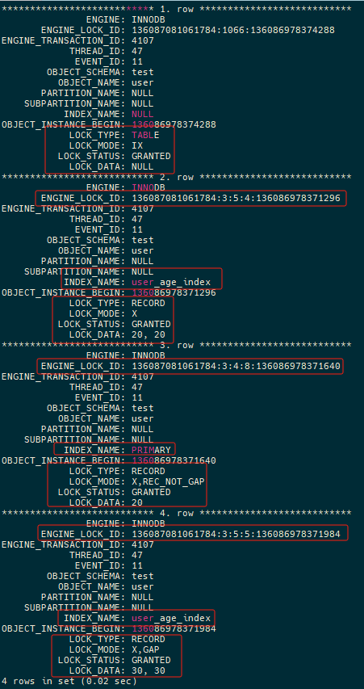


- 在`user_age_index`索引的age=20的记录上加了一个X型的Next-Key Lock，范围是(11,20]
  
  - 此时其他事务如果想插入age范围在(11,20)的记录，都会被阻塞
  
  - 此时其他事务如果想更新、删除、插入age=20的记录，都会被阻塞
  
  - 此时其他事务如果想插入age=11，id范围在(11,+∞)的记录，都会被阻塞
  
  - 此时其他事务如果想插入age=11，id范围在(-∞,11)的记录，都会成功

- 在主键索引的id=20的记录上加了一个X型的Record Lock
  
  - 此时其他事务如果想更新、删除、插入id=20的记录，都会被阻塞
    
    | 时间线 | 事务1                                           | 事务2                                            |
    | --- | --------------------------------------------- | ---------------------------------------------- |
    | T1  | start transaction;                            | start transaction;                             |
    | T2  | select * from user where age = 20 for update; |                                                |
    | T3  |                                               | update user set name = 200 where id= 20; // 阻塞 |
    
    事务2的信息：
    
    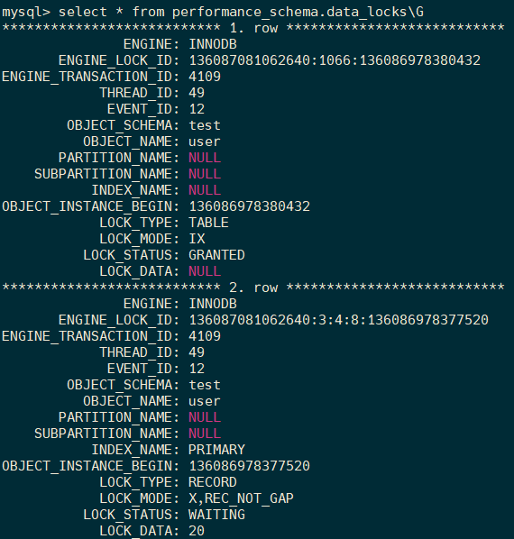
    
    `SELECT * FROM performance_schema.data_lock_waits \G`查询锁等待情况
    
    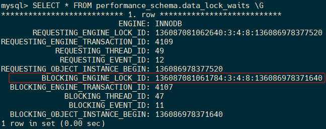
    
    `BLOCKING_ENGINE_LOCK_ID=136087081061784:3:4:8:136086978371640`正是事务1的PRIMARY索引的id=20的Record Lock（见前面图的3.row）
    
    表示事务2当前正在等待事务1的的PRIMARY索引的id=20的Record Lock的锁。

- 在`user_age_index`索引的age=30的记录上加了一个X型的Gap Lock，范围是(20,30)，`LOCK_DATA`中第一个30是age=30，第二个30是该记录的id=30
  
  - 此时其他事务如果想插入age范围在(20,30)的记录，都会被阻塞
  
  - 此时其他事务如果想插入age=30，id范围在(-∞,11)的记录，都会阻塞（排除id已存在的，比如id=10会被主键唯一性约束检测返回失败）
  
  - 此时其他事务如果想插入age=30，id范围在(30，+∞)的记录，都会成功

以上重点分析了Next-KeyLock(11,20]和Gap Key Lock(20,30)的边界值age=11、30时的插入情况，因为age并没有唯一性约束，所以当插入的记录的age=11、30时，在部分场景下是可以成功的，如上面的举例。

#### 查询记录不存在

```sql
start transaction;
select * from user where age = 25 for update; --表中没有age=25的记录
```


在`user_age_index`索引的age=30的记录上加了一个X型的Gap Lock，范围是(20,30)。

- `LOCK_DATA`的第一个30是age的30，第二个30指的是age=30记录的id值也是30。

- 引擎在`user_age_index`索引上从前往后扫描，10、11、20、30，当扫描到30时确定了25并不在索引记录中，此时确定了Gap Lock的范围即是(20,30)

- 此时其他事务如果想插入age范围在(20,30)的记录时，都会阻塞

- 此时其他事务如果想插入age=20，id范围在(20,+∞)的记录时，都会阻塞，因为待插入的记录也会洛在`user_age_index`索引的(20,30)记录之间

- 此时其他事务如果想插入age=20，id范围在(-∞,20)的且id不等于10、11的记录时，都能成功

- 此时其他事务如果想插入age=30，id范围在(-∞,30)的记录时，都会阻塞，因为待插入的记录也会洛在`user_age_index`索引的(20,30)记录之间

- 此时其他事务如果想插入age=30，id范围在(30,+无穷大)的记录时，都会能成功

- 此时其他事务如果想插入age范围在(-∞,20)、(30,+∞)的记录时，都可以成功（排除id已存在的）

从上边可以看出，非唯一索引上的等值查询时，对于锁住的非唯一索引记录(age)的GapLock的**边界值**，能否插入成功还需要看待插入记录的主键值(id)是否在锁住的age索引中对应的id范围内，如果在则插入被阻塞，如果不在则插入成功。

### 非唯一索引范围查询

这里只分析大于的场景，小于（<）的加锁逻辑类似于大于；小于等于（<=）、大于等于（>=）的场景也是结合了小于、大于和等于的场景。

#### 大于（>）

```sql
start transaction;
select * from user where age > 15 for update;
```

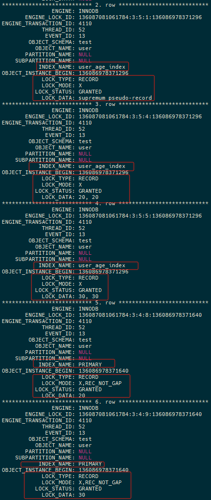

（截图中第一条是表级别意向锁，这里不再赘述展示）


`user_age_index`索引上有三个行级别的锁：

- X型的Next-Key Lock，锁在age=20，范围为(11,20]

- X型的Next-Key Lock，锁在age=30，范围为(20,30]

- X型的Next-Key Lock，锁在age=supremum pseudo-record，范围为(30,+∞]

主键索引`PRIMARY`上有两个行级别的锁：

- X型的Record Lock，锁在id=20

- X型的Record Lock，锁在id=30

### 无索引的查询

如果update、delete、select ... for update、select ... for share等加锁性质的语句没有走到索引，导致全表扫描，那么PRIMARY（主键）索引的所有记录都会加上Next-Key Lock，相当于对整个表都加锁了。所以需要极力保证这些语句走索引。

```sql
start transation;
select * from user where name = 20 for update;
```

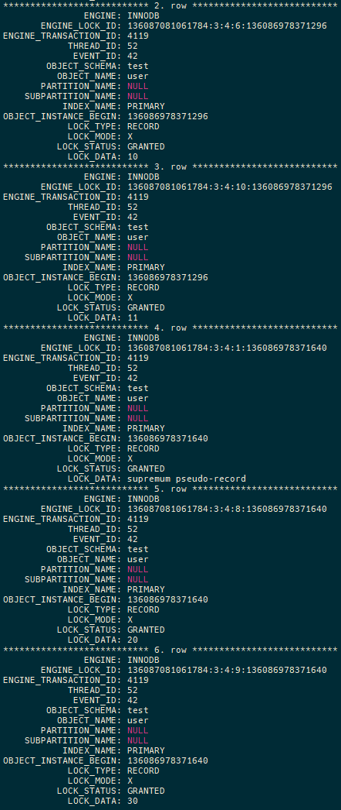

**注意**：如果因为没有走索引导致这种场景的几乎全表锁，也并不是在另一个事务中所有其他CRUD都会被阻塞，比如以下场景都可以成功

|        |                                          | 说明                                                                              |
| ------ | ---------------------------------------- | ------------------------------------------------------------------------------- |
| 快照读    | select * from user where id = 20;        | 此时是普通的select，没有for share、for update                                             |
| update | update user set name = 15 where id = 15; | 此时表中没有id=15的记录                                                                  |
| update | update user set name = 15 where age= 15; | 此时表中没有age=15的记录。<br/>update user set name = 15 where name = 15仍然会被阻塞，因为name没有索引 |
| delete | delete from user where id =15;           | 此时表中没有id=15的记录                                                                  |
| delete | delete from user where age =15;          | 此时表中没有age=15的记录。<br/>delete from user where name=15仍然会被阻塞，因为name没有索引            |

## 行级锁的互斥关系分析

### Record Lock（行记录锁）

|               | S-Record Lock | X-Record Lock |
| ------------- | ------------- | ------------- |
| S-Record Lock | 兼容            | 不兼容           |
| X-Record Lock | 不兼容           | 不兼容           |

### Gap Lock（间隙锁）

|            | S-Gap Lock | X-Gap Lock |
| ---------- | ---------- | ---------- |
| S-Gap Lock | 兼容         | 兼容         |
| X-Gap Lock | 兼容         | 兼容         |

### Insert Intention Lock（插入意向锁）

|               | Insert Intention Lock |
| ------------- | --------------------- |
| S-Record Lock | 不兼容                   |
| X-Record Lock | 不兼容                   |
| S-Gap Lock    | 不兼容                   |
| X-Gap Lock    | 不兼容                   |

### 总结

- Record Lock（行记录锁）是区分X、S型的，两个Record Lock 之间会**形成互斥关系**

- Gap Lock（间隙锁）是分X、S型的，两个Gap Lock之间**不会形成互斥关系**

- Insert Intention Lock（插入意向锁）理解为一个X型锁，会和Record Lock、Gap Lock形成互斥关系

- 为什么不关注Record Lock和Gap Lock之间的互斥关系：这两个可以理解为不同的范围，实际上肯定兼容

- 为什么不关注Next-Key Lock与其他的互斥关系：Next-Key Lock=Record Lock+Gap Lock，互斥关系也可以推导

- 为什么不分析两个Insert Intention Lock之间的互斥关系：因为获取Insert Intention Lock之前会先获取Record Lock、Gap Lock、Next-Key Lock，所以实际上是Insert Intention Lock和这三个行级别的锁之间的互斥关系

- Gap Lock会和Insert Intention Lock、表级别锁形成互斥关系

## 表级别的锁

### 表锁

```sql
lock tables user read; --- 表级别共享锁
lock tables user write; --- 表级别排他锁
unlock tables; --- 释放
```

### 元数据锁（MDL）

- S型元数据锁：在进行CRUD操作时，会在该表加上S型元数据锁

- X型元数据锁：在进行DDL操作时，会在表上加X型元数据锁

### 表级别的意向锁

#### 何时加表级别的意向锁？

##### 表级别的意向共享锁IS

在记录上加**行级别共享锁S**前，会先加一个**表级别的意向共享锁**，即（intension shared lock）

```sql
start transaction;
select * from  user where id = 11 for share; --- 此时会加一个IS和一个S型的Record Lock
commit;
```

##### 表级别的意向共享锁IX

在记录上加**行级别排它锁X**前，会先加一个**表级别的意向排它锁**，即**IX**（intension exclusive lock）

```sql
start transaction;
update user set age = 11 where id = 11; --- 此时会加一个IX和一个X型的Record Lock
commit;
```

#### 为什么需要表级别的意向锁？

当加记录锁时，先加一条表级别的意向锁，这样就不需要遍历每条记录来判断该表是否有行级别记录锁，就能直接知道当前还能不能再加其他表级别的锁，从而快速的执行表级别的其他锁。

### 表级别锁之间的互斥关系

|              | 表共享锁 | 表排它锁 | 表级别意向共享锁 | 表级别意向排它锁 | 元数据锁 |
| ------------ | ---- | ---- | -------- | -------- | ---- |
| 表共享锁         | 兼容   | 不兼容  | 兼容       | 不兼容      | 不兼容  |
| 表排它锁         | 不兼容  | 不兼容  | 不兼容      | 不兼容      | 不兼容  |
| **表级别意向共享锁** | 兼容   | 不兼容  | **兼容**   | **兼容**   | 不兼容  |
| **表级别意向排它锁** | 不兼容  | 不兼容  | **兼容**   | **兼容**   | 不兼容  |

可见，表级别意向锁是为了和表级别的其他锁（表锁，元数据锁）形成互斥关系，**而表意向锁和表意向锁并不形成任何互斥关系**。

可以通过以下例子验证**表级别意向排它锁**和**表级别意向排它锁**是相互兼容的关系。

|     | 事务1                                     | 事务2                                     |
| --- | --------------------------------------- | --------------------------------------- |
| T1  | start transaction;                      |                                         |
| T2  |                                         | start transaction;                      |
| T3  | update user set age = 11 where id = 11; |                                         |
| T4  |                                         | update user set age = 12 where id = 11; |
| T5  | commit;                                 |                                         |


可以看到，LOCK_STATUS=GRANTED，都是已获取状态。其中1.row和2.row是同一个事务id=2699；3.row和4.row是同一个事务id=2698。

### 总结

- 表级别意向锁是一种特殊的存在，会跟表级别的其他锁构成互斥关系；但是表级别意向锁和另一个事务表级别意向锁并不会互斥

- 表级别意向锁也不会跟行级别的**记录锁**（Record Lock）形成互斥关系

- 表锁、元数据锁都会和行级别的锁形成互斥关系

## 全局锁

```sql
flush tables with read lock; --- 全局锁，此时整个数据库处于只读状态
unlock tables; --- 释放全局锁
```

### 何时使用全局锁

全库备份时防止期间因数据记录或者表结构的变化导致备份的和预期的不一致。

案例分析？

全局锁和其他的锁的互斥关系：从它的作用来看，需要与X型表级别锁、X型行级别锁都要形成互斥，比如

- 对表结构的变更：alter table、drop table、create table等

- 对数据记录的变更：insert、update、delete等

## 死锁场景案例分析

### 1. 幂等插入订单记录

```sql
// 表结构如下
CREATE TABLE `t_order` (
  `id` int NOT NULL AUTO_INCREMENT COMMENT '自增id',
  `order_id` int DEFAULT NULL COMMENT '订单id',
  PRIMARY KEY (`id`),
  UNIQUE KEY `t_order_id_index` (`order_id`)
) ENGINE=InnoDB


// 业务场景如下，多个线程同并发执行以下事务
start transaction;
select 1 from t_order where order_id = 40 for update;
// 如果没有id=40的记录则插入
insert into t_order(order_id) values(40);
commit
```

表中数据如下


事务执行过程分析（由于这里的死锁是由于**行级锁**导致的，所以**表级别锁**就不在关注）

| 时序  | 事务1                                                   | 事务1加锁情况                                                                        | 事务2                                                                                                                                                       | 事务2加锁情况                                                                        |
| --- | ----------------------------------------------------- | ------------------------------------------------------------------------------ | --------------------------------------------------------------------------------------------------------------------------------------------------------- | ------------------------------------------------------------------------------ |
| T1  | start transaction;                                    | 无                                                                              | start transaction;                                                                                                                                        | 无                                                                              |
| T2  | select 1 from t_order where order_id = 40 for update; | t_order_id_index索引上的`supremum pseudo-record`记录的**X型Next-Key Lock**，范围为(30, +∞] |                                                                                                                                                           |                                                                                |
| T3  |                                                       |                                                                                | select 1 from t_order where order_id = 41 for update;                                                                                                     | t_order_id_index索引上的`supremum pseudo-record`记录的**X型Next-Key Lock**，范围为(30, +∞] |
| T4  | insert into t_order(order_id) values(40);  // 此时会阻塞   |                                                                                |                                                                                                                                                           |                                                                                |
| T5  |                                                       |                                                                                | insert into t_order(order_id) values(41); // 此时死锁产生，此时事务2被Mysql 回滚：ERROR 1213 (40001): Deadlock found when trying to get lock; try restarting transaction |                                                                                |
| T6  | 此时T4的插入语句执行完成，因为T5时刻的事务2被回滚                           |                                                                                |                                                                                                                                                           |                                                                                |

1. T2时刻事务1在`t_order_id_index`索引上的`supremum pseudo-record`特殊记录上加了一个Next-Key Lock

2. T3时刻事务2也在`t_order_id_index`索引上的`supremum pseudo-record`特殊记录上加了一个Next-Key Lock。前面我们说Next-Key Lock是Gap Lock + Record Lock，也就是Gap Lock：(30,+∞)和Record Lock：`supremum pseudo-record`，这里有两个问题：
   
   1. 为什么两个事务能都能获得`supremum pseudo-record`的Record Lock？
      
      如果一个事务在某条记录上加了一个X型Record Lock，其他事务是不能再获取这条记录的X型Record Lock的，这里事务2为什么也同时可以获取呢？实际上`supremum pseudo-record`并不真实存在，这里虽然显示的是Next-Key Lock，锁住的范围确是(30,+∞)，并没有Record Lock。
   
   2. 为什么事务1锁住了(30,+∞)范围，事务2还能锁住(30,+∞)范围
      
      Gap Lock 和Gap Lock 并不形成互斥关系

3. T4时刻事务1尝试获取id=40的`INSERT_INTENTION`插入意向锁，但是一直处于`WAITING`状态，因为40正处于事务2的Gap Lock(30,+∞)内，所以被阻塞

4. T5时刻事务2尝试获取id=41的`INSERT_INTENTION`插入意向锁，但是41正处于事务1的Gap Lock(30,+∞)内，此时InnoDB引擎检测到事务1和事务2发生了死锁情况，直接结束回滚掉事务2

5. T6时刻，由于事务2被回滚，其持有的Gap Lock(30,+∞)被释放，事务1可以正常执行

> InnoDB引擎是何时进行检测是否发生了死锁？
> 
> 每个请求锁并发生等待时就会检测是否会存在死锁情况，具体是通过构造wait-for graph（等待图）然后依次检查每个节点看是否存在回路。

> 发生了死锁之后，InnoDB引擎如何选择回滚哪个事务？
> 
> InnoDB选择undo量最小的事务进行回滚

这个案例中t_order_id_index是一个唯一索引，但如果只是一个普通的非唯一索引时，上述的死锁场景依然成立

#### 解决思路

在进入插入订单业务逻辑时，业务使用key为orderid的分布式锁，然后事务内部可以使用快照读（即不再使用select ... for update，而是普通的select）。

```sql
redLock.lock(order_id_40); -- 分布式锁，比如redis的RedLock
start transaction;
select 1 from t_order where order_id = 40;
-- 如果不存在则插入
insert into t_order(order_id) values(40);
commit;
redLock.unLock(order_id_40);
```

这个场景出现的原因在于，为了防止同一个订单号被同时调用两次`插入逻辑`，但是却在Innodb引擎层因为两个不同的订单号的插入而死锁。所以只需要先保证同一个订单号在同一个时刻只能有一个线程进入`插入逻辑`即可。

### 2. 投资贷款

将投资人A、B的钱拆成两份借给C、D两人，两个事务获取锁的顺序不一致导致死锁。

| 时间线 | 事务1                            | 事务2                            |
| --- | ------------------------------ | ------------------------------ |
| T1  | start transation;              | start transation;              |
| T2  | update ... where id = A;       |                                |
| T3  |                                | update ... where id = B;       |
| T4  | update ... where id = B; // 阻塞 |                                |
| T5  |                                | update ... where id = A; // 死锁 |

表中id是唯一索引或者非唯一索引都会死锁

#### 解决思路

在事务开始时就锁住A、B两个记录，比如`select ... where id in('A', 'B') for update;`这个语句in中的A、B两个值不用区分先后。

### 3. 加锁先后顺序不同

```sql
CREATE TABLE `t_order` (
   `id` int NOT NULL AUTO_INCREMENT COMMENT '自增id',
   `day` char(8) DEFAULT NULL COMMENT '自然日',
   `userid` int DEFAULT NULL,
   PRIMARY KEY (`id`),
   KEY `index_order_userid` (`userid`),
   KEY `index_order_day` (`day`)
) ENGINE=InnoDB;=InnoDB;
```

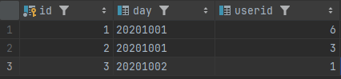

| 时间线 | 事务1                                           | 事务2                                      |
| --- | --------------------------------------------- | ---------------------------------------- |
| T1  | start transaction;                            | start transaction;                       |
| T2  | select * from t_order where day = '20201001'; |                                          |
| T3  |                                               | select  * from t_order where userid > 1; |

事务1的记录锁情况

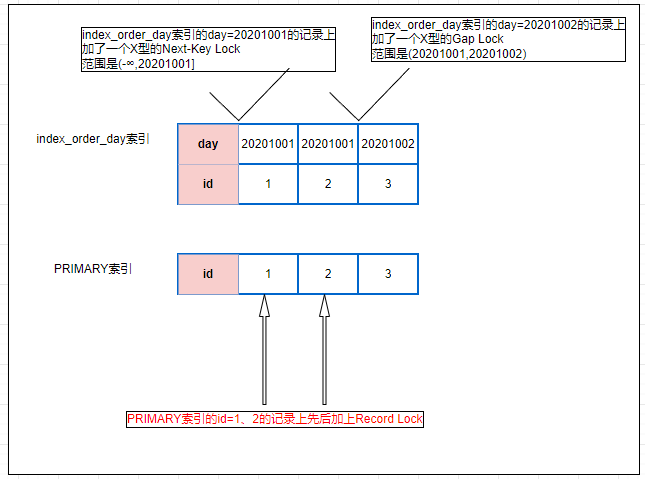

事务2的加锁情况

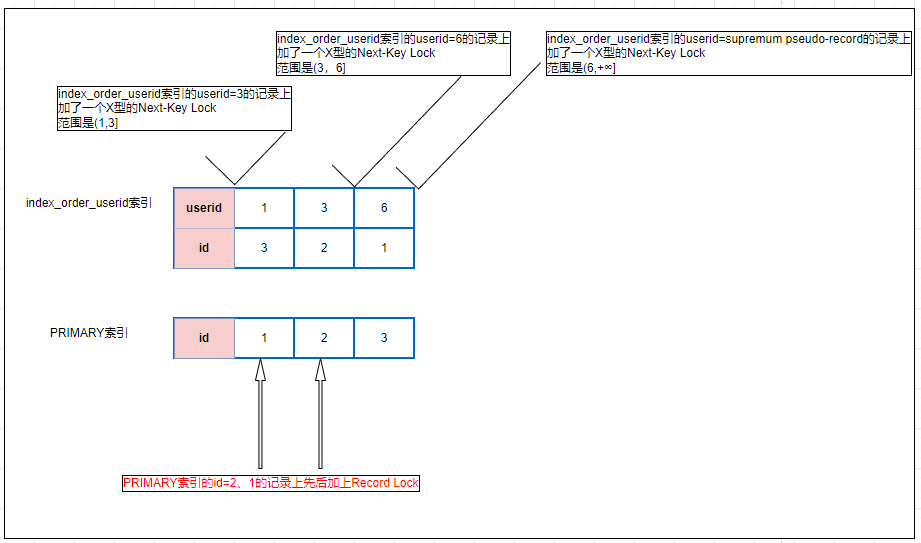

可以见事务1和事务2同时都在主键索引上的id=1和id=2的记录上加锁了，但是顺序却不同，所以可能导致死锁。但是这种概率非常小。

## 排查死锁的思路

### `show engine innodb status`查看最近一次死锁详情

以下即是死锁日志


其中`LATEST DETECTED DEADLOCK`关键字指示了有死锁产生

### 查看具体死锁的详情

```sql
select * from INFORMATION_SCHEMA.INNODB_TRX; -- 查看事务 >V5.6
select * from INFORMATION_SCHEMA.INNODB_LOCKS; -- 查看锁 V5.6
SELECT * FROM performance_schema.data_lock_waits; -- 查看锁等待情况 V8.0
select * from INFORMATION_SCHEMA.INNODB_LOCK_WAITS; -- 查看锁等待 V5.6
select * from INFORMATION_SCHEMA.PROCESSLIST; -- 查看连接情况 >V5.6 
```

### 查看数据库中所有锁的整体情况

```sql
show status like 'InnoDB_row_lock%';
```

| 字段                            | 说明                     |
| ----------------------------- | ---------------------- |
| Innodb_row_lock_current_waits | 当前正在等待锁定的数量            |
| Innodb_row_lock_time          | 等待总时长: 从系统启动到现在锁定总时间长度 |
| Innodb_row_lock_time_avg      | 等待平均时长: 每次等待所花平均时间     |
| Innodb_row_lock_time_max      | 从系统启动到现在等待最长的一次所花时间    |
| Innodb_row_lock_waits         | 等待总次数: 系统启动后到现在总共等待的次数 |


### 开启死锁日志自动记录到`error.log`

```sql
show variables like 'innodb_print_all_deadlocks'; --- 查看是否开启死锁日志记录
set global innodb_print_all_deadlocks = 1; --- 动态开启死锁日志记录，但是重启后会重置为配置文件的设置
--- 修改配置文件
[mysqld]
log_error = /var/log/mysql/error.log # 错误日志地址
innodb_print_all_deadlocks = 1 # 死锁日志自动记录到error日志中
```

以下即为开启`innodb_print_all_deadlocks`后的死锁日志，包含`transactions deadlock detected`关键字

 

### Mysql 配置文件路径

#### 默认配置文件路径

```sql
mysql --help 指示了默认的配置文件地址，如下
Default options are read from the following files in the given order:
/etc/my.cnf /etc/mysql/my.cnf ~/.my.cnf
```

mysql 会按照如下的顺序进行查找，后读入的配置文件会覆盖先读入的配置文件

1. /etc/my.cnf

2. /etc/mysql/my.cnf

3. ~/.my.cnf

比如如果配置文件在`/etc/mysql/my.cnf`，其中内容包含

```mysql
!includedir /etc/mysql/conf.d/ # 指示需要包含/etc/mysql/conf.d/目录下的所有.cnf的文件
!includedir /etc/mysql/mysql.conf.d/ # 指示需要包含/etc/mysql/mysql.conf.d/目录下的所有.cnf的文件
```

#### 各个操作系统的配置文件路径

| 安装方式                     | 默认路径                            |
| ------------------------ | ------------------------------- |
| Linux（如 Ubuntu、CentOS 等） | /etc/mysql/my.cnf 或 /etc/my.cnf |
| Windows                  | 安装路径下的 my.ini 文件                |
| macOS 使用官方安装包（DMG）安装     | /usr/local/mysql/my.cnf         |
| macOS 使用 Homebrew 安装     | /usr/local/etc/my.cnf           |
